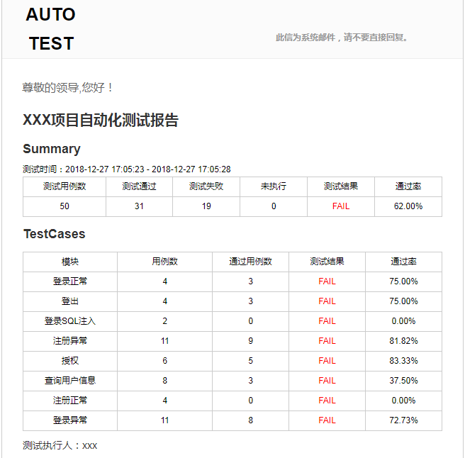
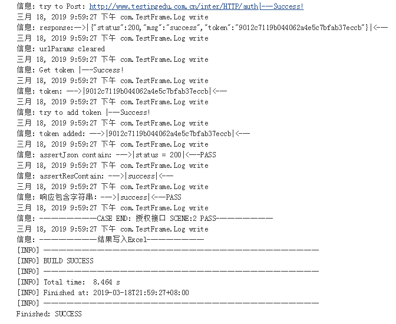

# TestFrame

#### *结合Jenkins使用的一个接口&Web自动化测试框架*

----

Java | maven | Apache Http client | Selenium | Apache poi | Javax mail

---

#### 特性

- excel组织用例 数据源

- 命令执行 or jenkins执行

- 执行整个excel用例 or 根据数据源范围执行用例

- 自动生成详细日志

- 自动生成html报告

- 自动发送邮件

----

Report

Log

